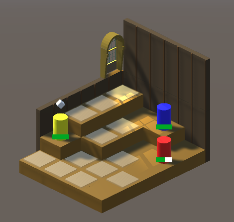

# TacticsGame
Attempting to make a tile-based tactics game.

Currently allows:
* Placing multiple units
* Selecting individual units
* Commanding selected unit to move, after viewing a preview of valid tiles to move to
* Commanding selected unit to attack a chosen enemy that is in range (there is only one enemy for now)
* Damaging units, with health bars to show current health

I'm working on Enemy AI, right now they can select tiles and move to them but I'd like to make it more intelligent

